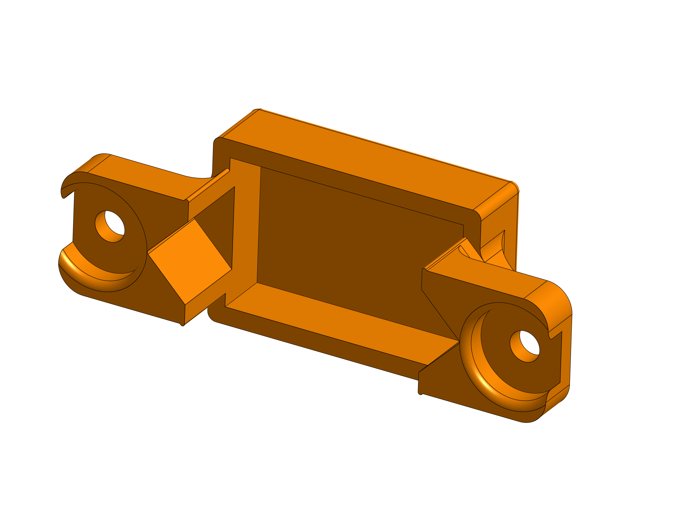
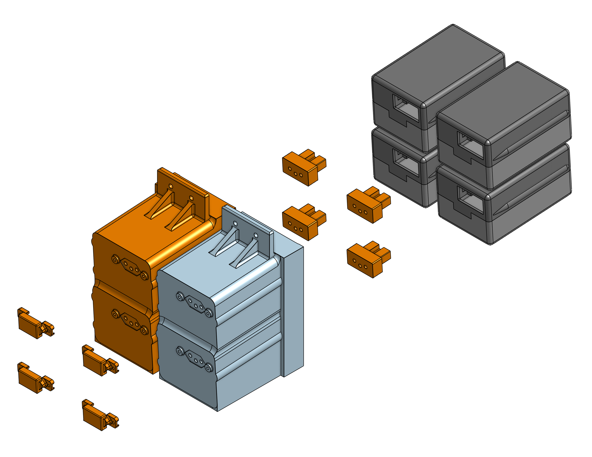

# Design Considerations

 
The design of the hotswap system for the M.I.C.K.Y. robot was guided by a combination of electrical and mechanical constraints. The goal was to develop a solution that is not only functionally reliable, but also reproducible and accessible, particularly in contexts where specialized components may be difficult to obtain.

## Component Accessibility and Cost Efficiency

A central design principle was the use of widely available, low-cost components. The adoption of the NBR 14136 standard connector (20A rating) reflects this approach, as it is commonly found in the Brazilian market and does not require specialized procurement channels. This choice reduces overall system cost and simplifies maintenance, as replacement parts can be easily sourced. Even though, the system can be easily adapted to support another type of connector or socket of power outlet. Additionally, the use of additive manufacturing for structural components allows for rapid prototyping and customization without significant increases in production cost. This approach also enables iterative improvements to the design.

<figure style="text-align: center;">
  
  <figcaption><i>In our system, we use this piece to support the NBR 14136 after the modifications that will be later explained.</i> </figcaption>
</figure>

## Electrical Reliability

 
The system was designed to ensure stable electrical contact under dynamic operating conditions. The selected connector provides sufficient current capacity for the robot’s power requirements, while also offering robust physical contacts. The integration of XT30 connectors between the battery and the main connector improves modularity and facilitates safe handling during battery replacement. Furthermore, the use of fork (spade) terminals ensures secure and maintainable connections at the interface with the NBR connector. Care was taken to minimize contact resistance and avoid intermittent connections, which could compromise system performance or damage electronic components.

## Mechanical Guidance and Error Prevention

 
A key challenge in hotswap systems is preventing incorrect insertion, which may lead to short circuits or mechanical damage. To address this, the design incorporates guiding rails that constrain the motion of the battery drawer, allowing insertion only along a predefined path. These rails act as a passive alignment mechanism, ensuring that the electrical contacts engage properly. This reduces user error and eliminates the need for complex active alignment systems.

In addition to the guiding rails, the connector is intentionally positioned off-center within the enclosure. This asymmetry introduces a geometric constraint that further prevents incorrect insertion. Even in the unlikely event that the guiding rails are bypassed or worn, the off-centered configuration reduces the probability of improper mating between connectors. This redundancy enhances overall system safety.

<figure style="text-align: center;">
  
  <figcaption><i>Better view of the assymetric alignment rail.</i></figcaption>
</figure>

## Passive Retention and Dynamic Stability

 
The system must remain mechanically stable during robot operation, particularly under acceleration and vibration. Instead of relying on locking mechanisms, the design employs a passive retention strategy.

A slight inclination of 5° is introduced between the battery drawer and the socket base. This inclination generates a component of force that naturally keeps the battery engaged with the connector, that togheter with other friction enhancing mechanisms, conteract inertial effects that could otherwise cause disconnection. At the same time, the absence of active locks allows for quick and tool-free battery replacement, which is essential for practical usability.

## Modularity and Maintainability

 
The design emphasizes modularity, allowing individual components (such as connectors, wiring, or printed parts) to be replaced independently. This reduces maintenance complexity and increases the system’s lifespan. The separation between the battery (via XT30) and the main connector also enables safer handling and easier diagnostics in case of failure.

<figure style="text-align: center;">
  
  <figcaption><i>Hotswap exploded for better view of the project modularity.</i> </figcaption>
</figure>

## Safety Considerations

 
Although the system operates without active locking or electronic protection mechanisms, several passive safety features were incorporated:

- Controlled insertion path through guiding rails;
- Asymmetric connector placement;
- Firm mechanical contact through connector resistance;
- Secure electrical terminations using appropriate connectors.

These measures collectively reduce the likelihood of user error, accidental disconnection, and electrical faults.

