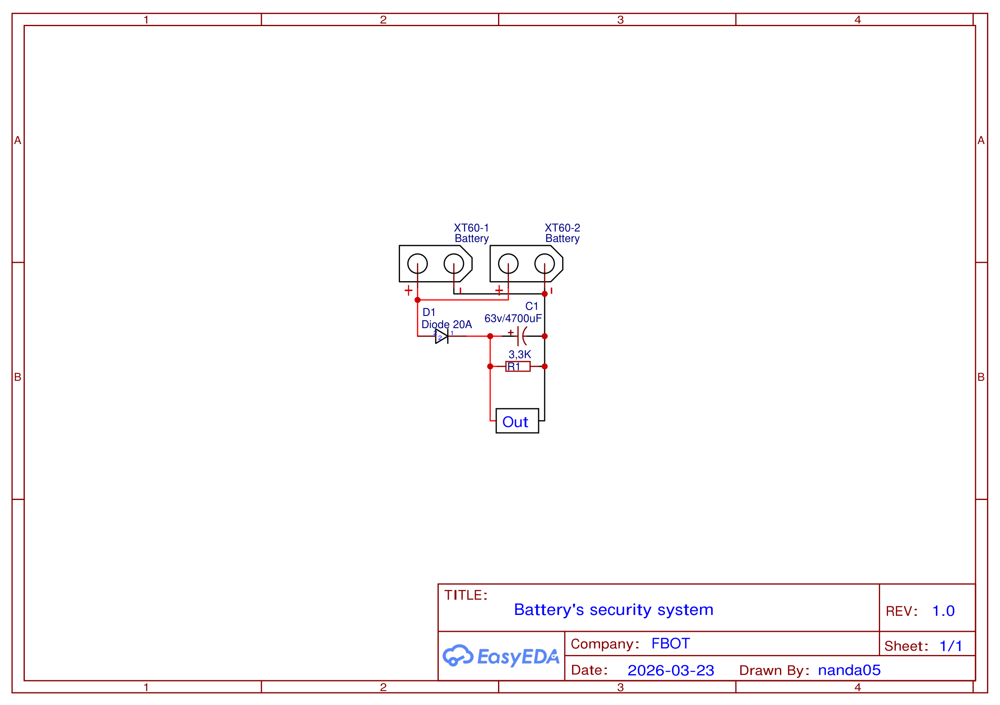
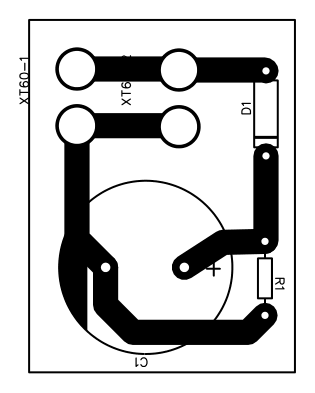
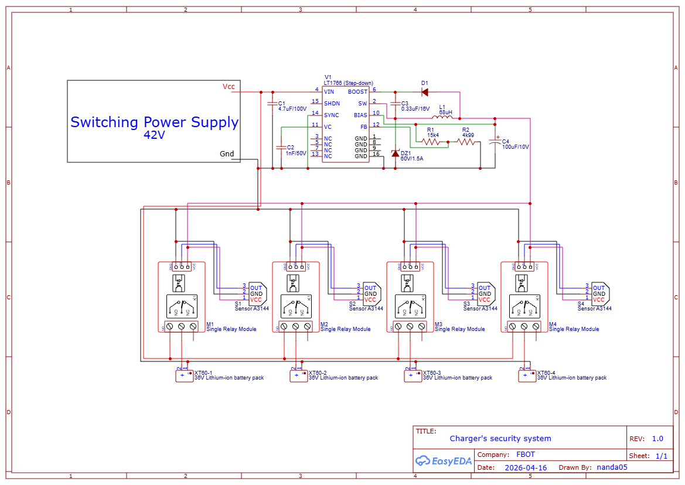

# PCBs and components

In here, the electrical PCBs of the systems will be better described. we'll descibre both, theirs functions and making of.

## PCBs description

### Hot-swap's protection system

To protect the system from back-electromotive force (back-EMF) generated by stepper motors, a safety system was implemented using a bleed resistor concept. This circuit utilizes a high-voltage capacitor (53V/4700uF) to store reverse current, which is subsequently dissipated as heat through a 3.3kΩ resistor. The primary components include:

- 20A Diode
- 3.3kΩ Resistor
- Capacitor (53V/4700uF)

<figure style="text-align: center;">
  
  <figcaption><i>Battery protection system's schematic.</i></figcaption>
</figure>

<figure style="text-align: center;">
  
  <figcaption><i>Battery protection system's PBC with components guide.</i></figcaption>
</figure>

### Charging Station's circuit

This circuit is based on a power supply structure for charging 36V Lithium-ion battery packs, featuring a protection system with magnetic sensing and switching via relays. To supply the sensors and actuators, a LT166 step-down IC was included, reducing the voltage to 5V. It comprises the following components:

- LT166 Voltage Regulator
- A3144 Magnetic Sensor
- Diode, Capacitor, and Resistor network
- Relay Module

<figure style="text-align: center;">
  
  <figcaption><i>Charging station's circuit schematic.</i></figcaption>
</figure>

## PCB Fabrication
This section describes the process used to manufacture the custom Printed Circuit Boards (PCBs) developed for the MICKY robot. The boards were produced using a low-cost and accessible method, allowing easy replication without specialized equipment.

### Required Materials
- Copper-clad board
- Photographic paper
- Ferric chloride solution
- Any heat-generating surface
- Permanent marker

### Fabrication Process
1. <b>Print the PCB layout</b>
Print the PCB design at a 1:1 scale on photographic paper.

2. <b>Transfer the layout</b>
Place the printed layout face-down on the copper board.
Apply heat and pressure using an iron to transfer the ink onto the copper surface.

3. <b>Remove the paper</b>
Carefully remove the photographic paper using a gentle stream of water.

4. <b>Fix imperfections</b>
Use a permanent marker to correct any broken traces.

5. <b>Etching process</b>
Submerge the board in ferric chloride solution to remove the exposed copper.

6. <b>Cleaning and finishing</b>
Clean and sand the board to remove the ink.
The PCB is now ready for soldering.

## System's power supply

To ensure reliable operation under continuous charging cycles, some minor modifications were made to a 42V/10A switching power supply. One of the fixed resistors is replaced with a trimpot, allowing adjustment of the output current for improved control of the charging process. Additionally, a display is added to the power supply circuit to indicate the output voltage and current, aiming to optimize the diagnosis of potential issues that may arise due to inconsistent charging values. 

## PCB's Download

You can click 
<a href="../_static/PCB-Battery_protection_system.pdf" download>here</a>
to download the PCB's pdf file for printing.