# PCBs and components
<div style= "text-align: justify"> 
In here, the electrical PCBs of the systems will be better described. we'll descibre both, theirs functions and making of.

## PCBs description


### Hotswap's protection system

To protect the system from back-electromotive force (back-EMF) generated by stepper motors, a safety system was implemented using a bleed resistor concept. This circuit utilizes a high-voltage capacitor (53V/4700uF) to store reverse current, which is subsequently dissipated as heat through a 3.3kΩ resistor. The primary components include:


- 20A Diode
- 3.3kΩ Resistor
- Capacitor (53V/4700uF)


<figure style="text-align: center;">
  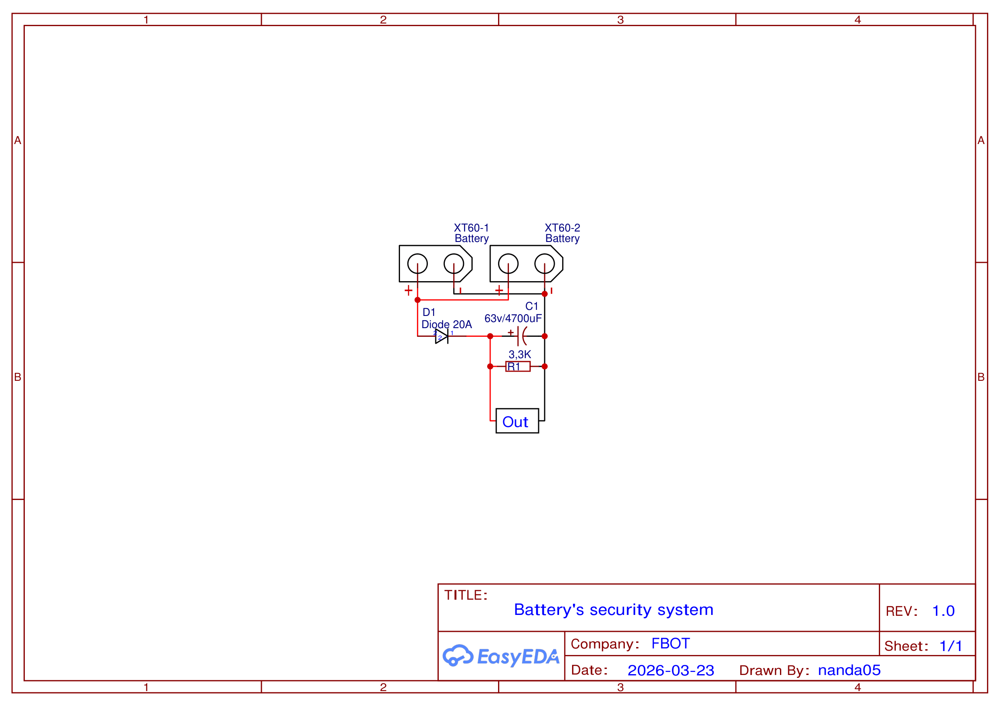
  <figcaption><i>Battery protection system's schematic.</i></figcaption>
</figure>


<figure style="text-align: center;">
  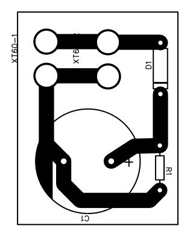
  <figcaption><i>Battery protection system's PBC with components guide.</i></figcaption>
</figure>


### Charging Station's circuit


This circuit is based on a power supply structure for charging 36V Lithium-ion battery packs, featuring a protection system with magnetic sensing and switching via relays. To supply the sensors and actuators, a LT166 step-down IC was included, reducing the voltage to 5V. It comprises the following components:


- LT166 Voltage Regulator
- A3144 Magnetic Sensor
- Diode, Capacitor, and Resistor network
- Relay Module


<figure style="text-align: center;">
  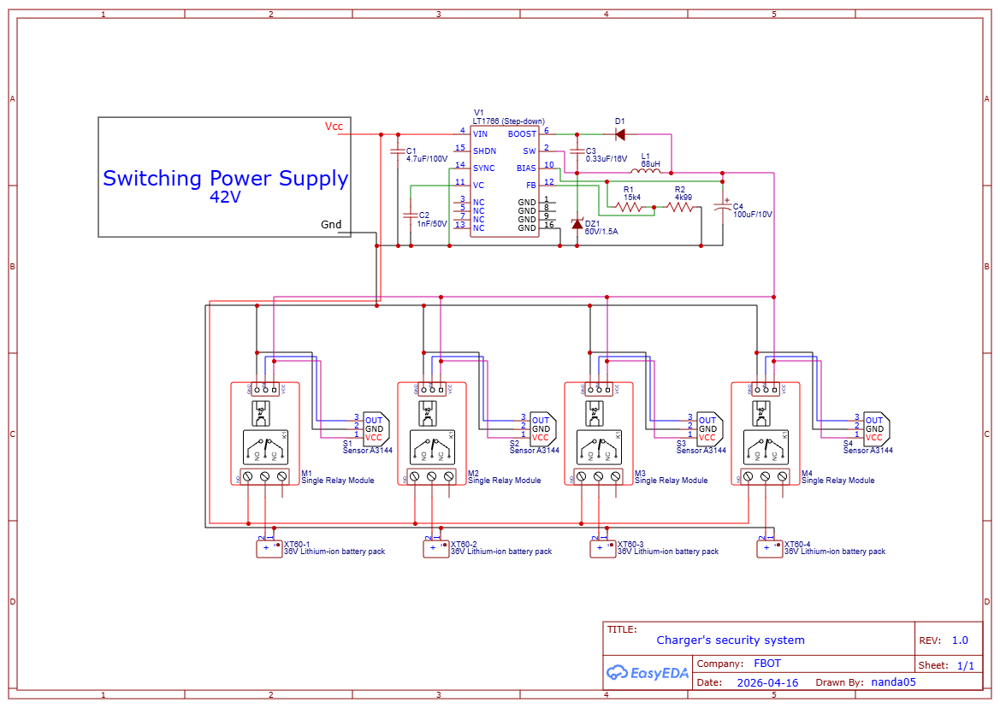
  <figcaption><i>Charging station's circuit schematic.</i></figcaption>
</figure>


## PCB Fabrication
This section describes the process used to manufacture the custom Printed Circuit Boards (PCBs) developed for the MICKY robot. The boards were produced using a low-cost and accessible method, allowing easy replication without specialized equipment.

### Required Materials
- Copper-clad board
- Photographic paper
- Ferric chloride solution
- Any heat-generating surface
- Permanent marker

### Fabrication Process
1. <b>Print the PCB layout</b>
Print the PCB design at a 1:1 scale on photographic paper.

2. <b>Transfer the layout</b>
Place the printed layout face-down on the copper board.
Apply heat and pressure using an iron to transfer the ink onto the copper surface.

3. <b>Remove the paper</b>
Carefully remove the photographic paper using a gentle stream of water.

4. <b>Fix imperfections</b>
Use a permanent marker to correct any broken traces.

5. <b>Etching process</b>
Submerge the board in ferric chloride solution to remove the exposed copper.

6. <b>Cleaning and finishing</b>
Clean and sand the board to remove the ink.
The PCB is now ready for soldering.


## System's power supply

This project demonstrates how to modify a standard switching power supply to turn it into a battery charger with an adjustable current limiter.


```{warning}
Notice: This procedure was performed on a generic power supply model. Since printed circuit board (PCB) designs vary by manufacturer, it is essential that you inspect the circuit and use a multimeter to check the traces before making any modifications. What works on this board may require adaptations for other models.
```

### Identifying and Modifying Feedback

The first step is to locate the shunt resistor (circled in red in Figure 1). It serves as the power supply’s current sensor. 


<figure style="text-align: center;">
  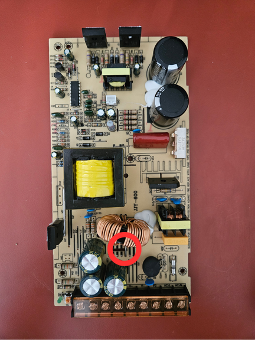
  <figcaption><i>Figure 1</i></figcaption>
</figure>

When turning the board over, as shown in Figure 2, we should follow the trace that carries the signal from this shunt to the controller IC.


<figure style="text-align: center;">
  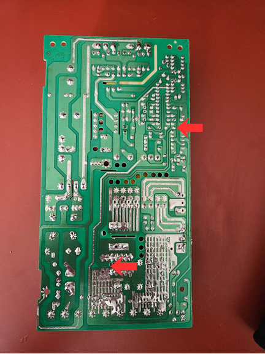
  <figcaption><i>Figure 2</i></figcaption>
</figure>

Along this circuit path, you will find a resistor (shown in Figures 3 and 4). To make the current limit adjustable, we removed this component and installed a 1kΩ trimpot.

<b>How does this work? </b> The power supply’s controller IC seeks to maintain a constant reference voltage. When you replace the fixed resistor with a trimpot, you gain the ability to adjust the gain of this feedback signal. This allows you to “tell” the power supply to limit the power earlier, protecting your batteries from overcharging.


<div class="figure-container">
<figure style="text-align: center;">
  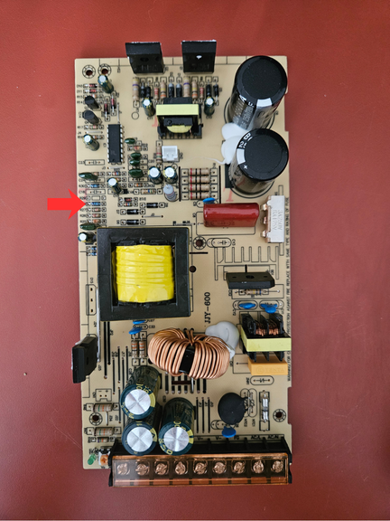
  <figcaption><i>Figure 3</i></figcaption>
</figure>

<figure style="text-align: center;">
  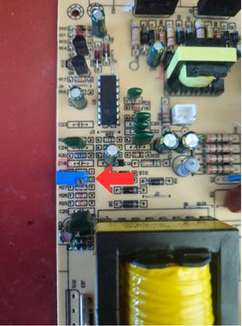
  <figcaption><i>Figure 4</i></figcaption>
</figure>
</div>

### Installation of External Monitoring


We need external monitoring to verify the battery charge information. To do this, we use an external voltmeter/ammeter module.
For the ammeter to work, it is necessary to make a notch in the trace connecting the shunt resistor to the power supply output, creating an isolation point (as shown in Figures 5 and 6). 

<figure style="text-align: center;">
  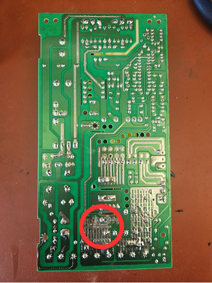
  <figcaption><i>Figure 5</i></figcaption>
</figure>

<figure style="text-align: center;">
  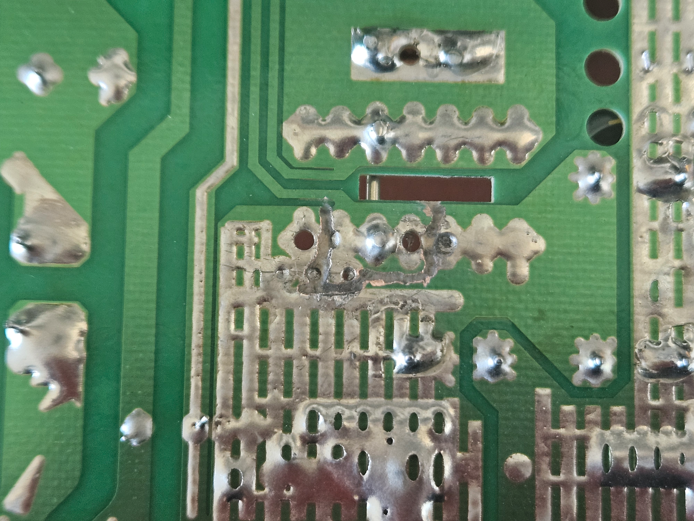
  <figcaption><i>Figure 6</i></figcaption>
</figure>


This cutout allows us to install the display’s current sensor in series, ensuring that the current drawn is accurately measured.
Figure 7 shows a 12V tap on the board itself to power the module, as well as the connection of the voltage measurement wire from the positive terminal of the power supply output to the voltmeter.


<figure style="text-align: center;">
  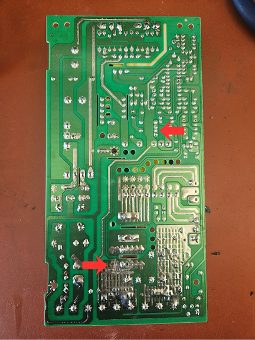
  <figcaption><i>Figure 7</i></figcaption>
</figure>


After verifying the connections, the board is reassembled into its original housing (Figures 8 and 9), resulting in a power supply with an adjustable current limit for charging the batteries.


<div class="figure-container">
<figure style="text-align: center;">
  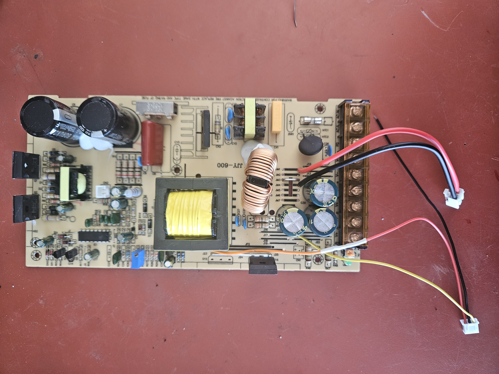
  <figcaption><i>Figure 8</i></figcaption>
</figure>

<figure style="text-align: center;">
  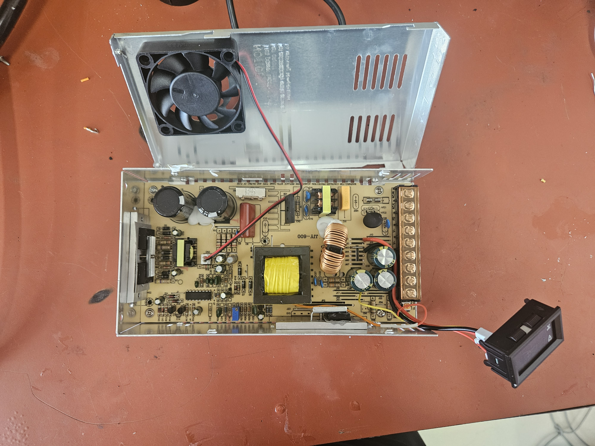
  <figcaption><i>Figure 9</i></figcaption>
</figure>
</div>

### Charging Procedure for the 42V Battery Bank

With the power supply assembled, follow these steps:

1. Start with a lower voltage setting and gradually increase the voltage and current.
2. Monitor the display until the final 42V is reached.
3. Adjust the trimpot so that the total current does not exceed 7A.
Since you will be charging 4 batteries in parallel, this configuration ensures approximately 1.75A for each one, which is a safe and efficient value to prevent thermal stress on the cells.

<b>List of components:</b>
- 42V/10A Switching Power Supply.
- 100V/10A Digital Voltmeter/Ammeter
- 1kΩ multi-turn trimpot.


## PCB's Download


You can click 
<a href="../_static/PCB-Battery_protection_system.pdf" download>here</a>
to download the PCB's pdf file for printing.
</div>