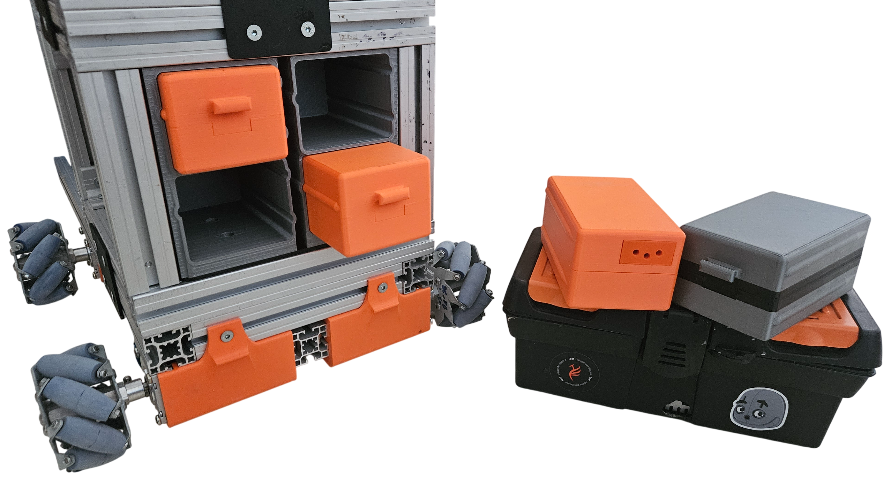
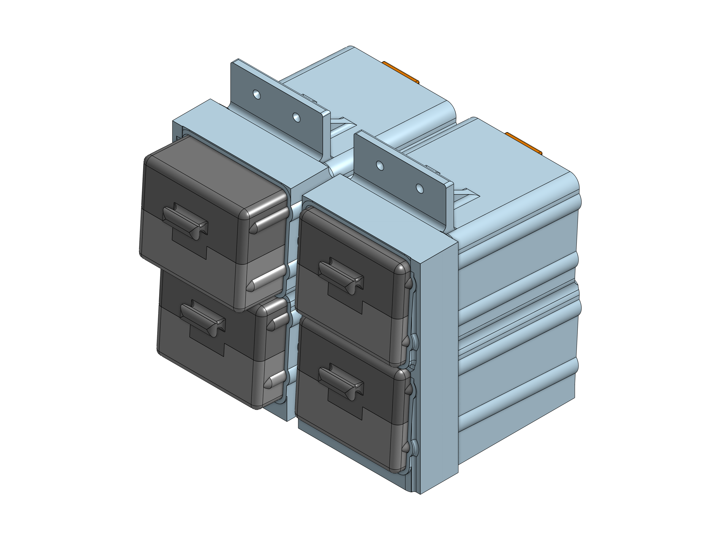

Accessible Battery Hot-Swap and Mobile Charging System
======================================================

<div style="text-align: justify;">
This work presents the development of a hotswap system designed for integration into the M.I.C.K.Y. robotic platform, with the primary objective of enabling efficient and reliable battery replacement during operation. The project focuses on delivering a practical solution that balances performance, safety, and cost, while remaining accessible in terms of both materials and fabrication processes.


<figure style="text-align: center; padding: 20px">
  
  <figcaption><i>General view of the hotswap and charging systems.</i> </figcaption>
</figure>


The proposed system combines electrical and mechanical design strategies to ensure stable power delivery and secure physical integration under typical operating conditions. Particular attention is given to ease of use, allowing battery modules to be replaced quickly and without the need for complex procedures or additional tools. At the same time, the design incorporates features intended to reduce the likelihood of incorrect handling and to maintain consistent operation even in dynamic environments.

Another key aspect of the project is its emphasis on reproducibility. By relying on commonly available components and leveraging digital fabrication techniques, the system can be readily implemented, adapted, and improved upon in different contexts. This makes it suitable not only for the specific platform for which it was developed, but also as a general approach for similar robotic or embedded systems.

Overall, the project demonstrates how careful integration of simple design principles can result in a robust and effective solution, highlighting the potential of accessible engineering practices in the development of functional and adaptable hardware systems.
</div>

<figure style="text-align: center;">
  
  <figcaption><i>General view of the hotswap system.</i> </figcaption>
</figure>


```{toctree}
:maxdepth: 2
:caption: See more here:

design/index
materials/index
eletronics/index
prints/index
```