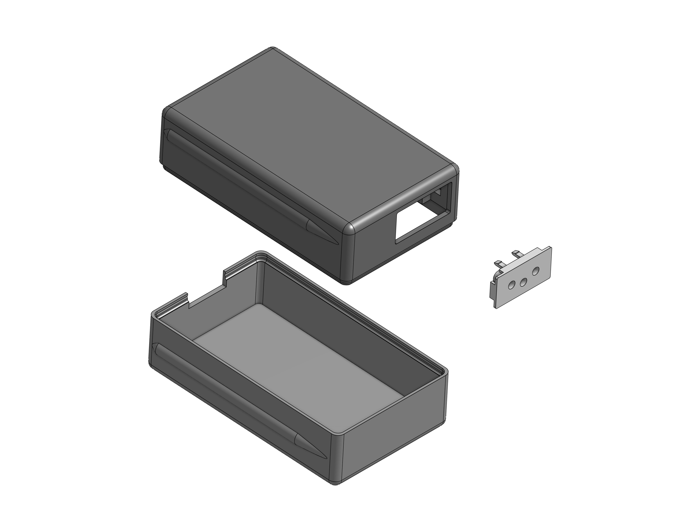
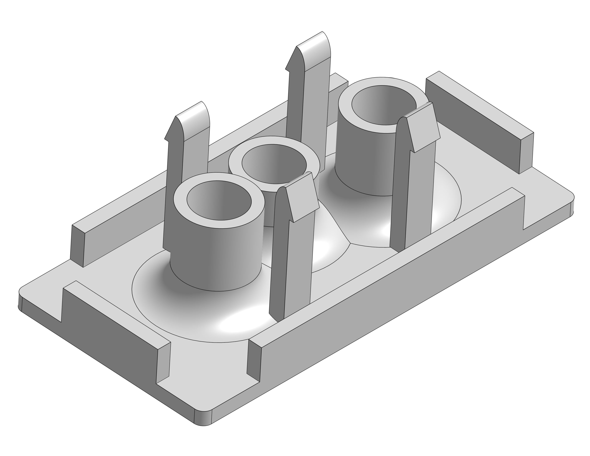
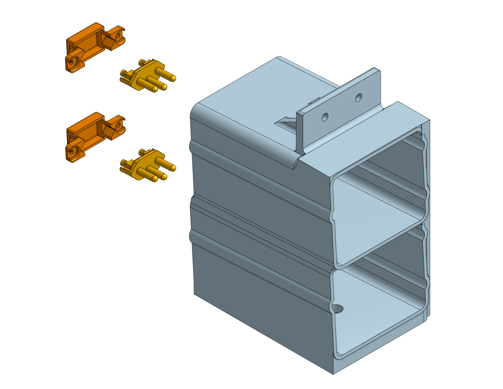
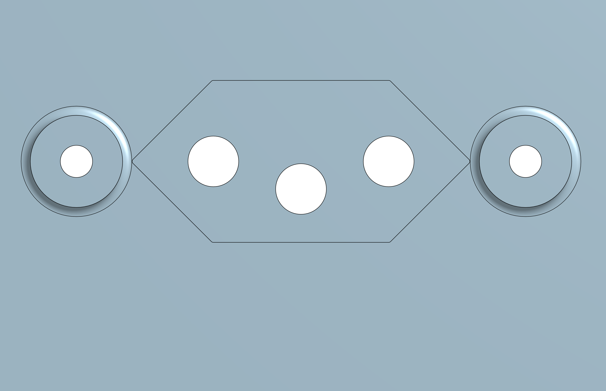

# Materials and assembly instructions

<div style= "text-align: justify">
This section outlines the materials required and the procedures necessary for assembling the hotswap system. The objective is to provide clear and reproducible guidelines that ensure proper mechanical integration and reliable electrical connections. Emphasis is placed on accessibility of components, simplicity of assembly, and adherence to the design principles described in the previous sections.
</div>

## Materials for Battery Drawers

<div style= "text-align: justify">
The following components are required for each battery drawer:

- Brazilian standard female socket (NBR 14136);
- 3D printing filament (material of choice);
- One XT30 female connector;
- Two fork (spade) cable terminals;
- One hoverboard battery;
- Electrical wires for XT30-to-connector integration.
</div>

<figure style="text-align: center;">
  
  <figcaption><i>Exploded view of the battery drawer.</i> </figcaption>
</figure>


## Drawer Assembly Procedure

<div style= "text-align: justify">
The assembly process is described as follows:

1. Remove the original interface from the NBR 14136 female connector.
2. Replace it with the custom-designed interface (as provided in the downloads page).

<figure style="text-align: center;">
  
  <figcaption><i>Part used as the new modified NBR module.</i> </figcaption>
</figure>

3. Fabricate the two halves of the drawer enclosure using additive manufacturing.
4. Insert the modified NBR connector into the designated slot in the upper enclosure half.
5. Establish electrical connections between the connector and the battery using the XT30 connector, wires, and fork terminals.
6. Position the battery within the enclosure and secure the assembly by closing the case.
</div>


## Materials for the Hotswap Socket

<div style= "text-align: justify">
Each socket assembly requires:

- Brazilian standard male plug (NBR 14136);
- 3D printing filament;
- Four screws M2.9;
- Four nuts M2.9;
- Two NBR 14136 male connectors.
</div>


<figure style="text-align: center;">
  
  <figcaption><i>Exploded view of the hotswap socket.</i> </figcaption>
</figure>


## Socket Assembly Procedure

<div style= "text-align: justify">
The socket assembly is performed according to the following steps:

1. Fabricate all structural components via 3D printing.
2. Disassemble the NBR 14136 male connector.
3. Remove the excess tabs formed during disassembly, retaining only the conductive pins and the wire terminal base.
4. Insert the prepared connector into the corresponding openings in the printed socket structure.

<figure style="text-align: center;">
  
  <figcaption><i>Socket opening for the connector.</i> </figcaption>
</figure>

5. Secure the assembly using the dedicated fastening component, screws, and nuts.
6. It is essential that the screw heads are oriented inward for proper fitting.
7. Perform all electrical connections to the connector prior to final mechanical fixation of the connector.


```{tip}
After assembling the socket, it is also recommended to fix it to the structure of the robot or machine it is going to power. For that, we added holes to improve its ability to be secured to aluminum profiles, both at the top and bottom. Alternatively, it can also be used with a cut acrylic sheet.
```

</div>

