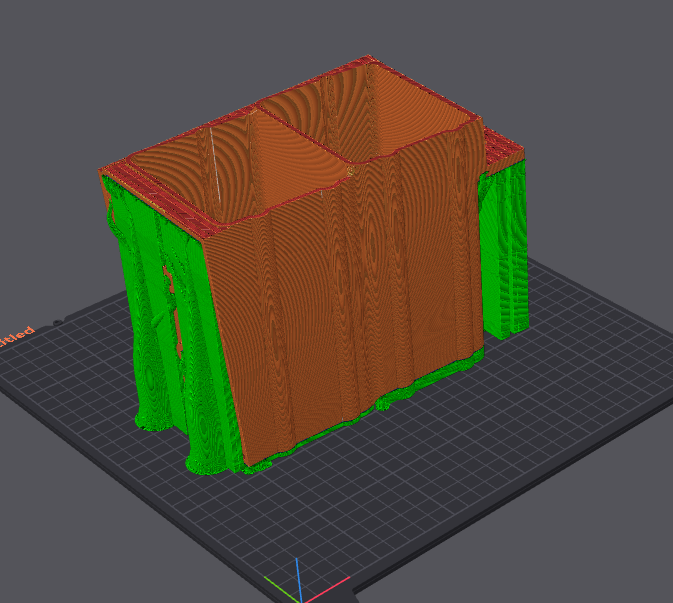
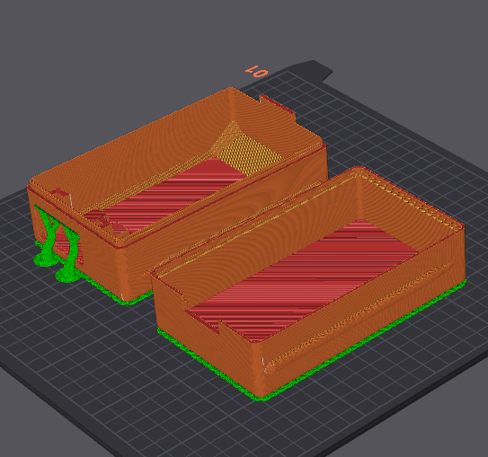
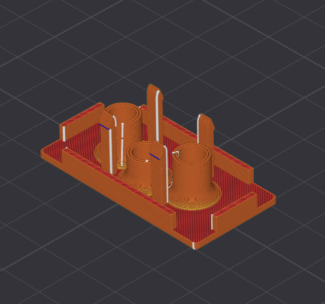
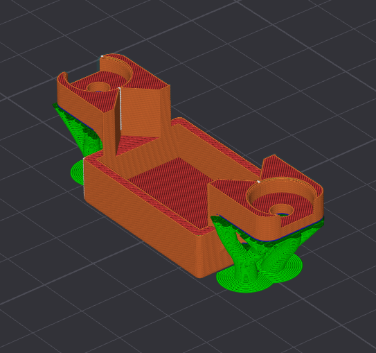

# 3D printed parts

<div style= "text-align: justify"> 
This section provides an overview of the 3D-printed parts used in the system, including their purpose, recommended printing orientation, and download links.


```{note}
We assume that you already have the basic knolowegde of 3D printing for the execution of this project.
```


## Parts and details

#### Sockets

For both socket parts, it is recommended that they be printed on the face where the connector is attached. This ensures that the print lines are perpendicular to the movement of the drawers. However, you may also choose a different printing orientation to minimize supports or to better suit your specific use case. It is also recommended to use an infill of about 10% with your preferred infill pattern.


<figure style="text-align: center;">
  
  <figcaption><i>Image of one of the hotswap sockets in the slicer, on the printing orientation.</i> </figcaption>
</figure>

#### Drawers

Both drawer parts are best printed using the largest face of each half, as shown in the image below. The parts are relatively simple, and four pairs are required for the assembly of the full system.


<figure style="text-align: center;">
  
  <figcaption><i>Image of a pair os parts that compose the drawer in the slicer, on the printing orientation.</i> </figcaption>
</figure>


#### Power outlet module

After removing the original module from the female power outlets, we recommend printing one of these parts for each outlet you want to replace. Its printing process is straightforward and fast. Below is an image illustrating the best printing orientation for this component.


<figure style="text-align: center;">
  
  <figcaption><i>Image of the power outlet modified module in the slicer, on the printing orientation.</i> </figcaption>
</figure>

#### Connector fixator


This part is used to secure the male connector to the back of the socket pieces. It is used four times in total in the system, with two units per socket. It is also a quick print, with a very intuitive printing orientation, as shown in the image.


<figure style="text-align: center;">
  
  <figcaption><i>Image of the connector fixator in the slicer, on the printing orientation.</i> </figcaption>
</figure>


## Download

- You can download either individual parts or the full system trough 
[this link](https://grabcad.com/library/accessible-battery-hotswap-system-1).

```{tip}
For this project, specifically, we used orca slicer, an opensource  alternative to other softwares available on the market.
```
</div>